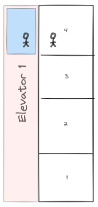

# Saleo Final Coding Challenge

## Local Setup

- If you would like to run the test cases:
  - Be sure to have at least node version 16.18.1 installed
  - Install dependencies using the following command:
  ```plaintext
  npm install
  ```
  - To run the test files, run the command:
  ```plaintext
  npm test
  ```

## A. One More Date Function

### Problem - Write a JavaScript Function that:

    1. Accepts a String
    2. Accepts the widest range of possible date-string inputs (i.e. "1/1", "12/31/2010", etc.)
    3. Converts the string to 5 distinct formats:
      - ISO
      - YYYY-MM-DD
      - D/M
      - Day of the Week
      - Full Month
    4. After calling the function you can use the chosen format throughout the rest of the code
    5. "Gracefully" handles a non-string input

### Implementation:

- Solution:

```javascript
const DateError = TypeError("Invalid Date String");

const leftPad = (num) => {
  return `${num < 10 ? "0" : ""}${num}`;
};

const formatDate = (dateString, format = "") => {
  if (typeof dateString !== "string") {
    throw DateError;
  }

  const date = new Date(dateString);
  if (!date) {
    throw DateError;
  }

  const months = [
    "January",
    "February",
    "March",
    "April",
    "May",
    "June",
    "July",
    "August",
    "September",
    "October",
    "November",
    "December",
  ];

  const days = [
    "Sunday",
    "Monday",
    "Tuesday",
    "Wednesday",
    "Thursday",
    "Friday",
    "Saturday",
  ];

  const monthString = leftPad(date.getMonth() + 1);
  const dayString = leftPad(date.getDate());

  res = {
    ISO: date.toISOString(),
    YYYYMMDD: `${date.getFullYear()}-${monthString}-${dayString}`,
    DM: `${date.getDate()}/${date.getMonth() + 1}`,
    dayOfWeek: days[date.getDay()],
    fullMonth: months[date.getMonth()],
  };

  return format in res ? res[format] : res;
};
```

- Description:
  The 'formatDate' function parses and formats a given date string into various date formats. It provides flexibility by allowing the user to specify teh desired output format

- Parameters:

  - 'dateString' (valid JS Date string): The input date to be formatted
  - 'format' (optional string): The desired format to be returned. Valid options are:

    - "ISO"
    - "YYYYMMDD"
    - "DM"
    - "dayOfWeek"
    - "fullMonth"

    **_Note_**: if there is no format argument or an invalid format argument passed to the function, an object containing all 5 formats will be returned.

- Exceptions:

  - If 'dateString' is not a valid JavaScript Date string, the function throws a TypeError with the message "Invalid Date String."

- Example Usage:

  - Note: more test cases can be seen in /OneMoreDateFunction/formatDate.test.js

  ```javascript
  const formattedDate1 = formatDate("2023-10-12", "DM");
  // formattedDate === "12/10"

  const formattedDate2 = formatDate("2024-2-29", "");
  /*
    {
      DM: "29/2",
      YYYYMMDD: "2024-02-29",
      dayOfWeek: "Thursday",
      fullMonth: "February",
      ISO: "2024-02-29T06:00:00.000Z",
    }
  */

  try {
    const formattedDate3 = formatDate(10);
  } catch (error) {
    console.log(error.message); // "Invalid Date String."
  }
  ```

## B. Playing Reversi - Reverse the Object

      Write a function that takes in an object as an argument, and returns an object where the keys of the returned object are the unique values of the input object and the values are an array of keys from the input object that are associated with that value

- Example:

  - Input:

  ```javascript
    {
        "John": "Engineer",
        "Alice": "Engineer",
        "Sam": "Accountant",
        "Leah": "Baker",
    }
  ```

  - Output:

  ```javascript
  {
    "Accountant": ["Sam"],
    "Baker": ["Leah"],
    "Engineer": ["Alice", "John"],
  }
  ```

  ### Implementation:

  - Solution:

  ```javascript
  const reversi = (obj) => {
    const res = {};

    Object.entries(obj).forEach(([key, val]) => {
      if (!(val in res)) {
        res[val] = [];
      }

      res[val].push(key);
    });

    // Sorting to have a deterministic output
    for (let key in res) {
      res[key].sort();
    }

    return res;
  };
  ```

  - Description:
    The 'reversi' function takes an input object ('obj') and returns a new object where the keys and values fo the input object are swapped.
    Additionally, the function ensures that the values in the original object are treated as keys in the result object, and the corresponding keys in the input object are collected into arrays associated with their respective values. The arrays are then sorted to ensure a deterministic output.

  - Parameters:

    - 'obj' (JavaScript Object): The input object to be formatted

  - Returns:

    - Object: A new object with the keys and values of the input object swapped, and the keys are grouped into arrays based on their corresponding values

  - Example Usage:
    - Note more test cases can be seen in PlayingReversi/reversi.test.js

  ```javascript
  const input = {
    Bob: "Engineer",
    Alice: "Engineer",
    Charlie: "Engineer",
    Dave: "Engineer",
    Edward: "Accountant",
    Sam: "Accountant",
    Leah: "Baker",
  };

  const result = reversi(input);
  /*
    {
      "Accountant": ["Edward", "Sam"],
      "Baker": ["Leah"],
      "Engineer: ["Alice", "Bob", "Charlie", "Dave"]
    }
  */
  ```

## C. The Elevator Challenge

#### The "pseudo code" of the final design can be found in /Elevator/Elevator.js

#### [Click here](#what-happens-when-we-add-the-second-elevator) to jump to the final walkthrough.

### Problem 1:

     In the near future a fictional company is opening a new building named "East" with 4 floors (East 1-4) and 2 elevators. How would you describe your design for the control program for those elevators? As in: when someone pushes the button, your program runs - what does it do?

#### Approach: Solve the simplest case first (1 elevator, 1 external request)


STEP 1: What is the expected behavior?

1. Alice pushes button on floor 1 to call the elevator
2. Elevator receives the request
3. Elevator moves to floor 1
4. Elevator Doors open
5. Alice enters elevator
6. Alice pushes internal elevator button to add destination
7. Doors close
8. Elevator moves to destination
9. Doors open
10. Alice exits

STEP 2: What are the components of this system?

1. External Button
2. Elevator Dispatcher
3. Elevator
4. Doors
5. Internal Button

- Since doors only open and close and buttons only add requests to the system we will focus on the elevator and dispatcher for now.

STEP 3: What properties does each object need to have?

- Dispatcher:
  - list of external requests: array of object { floor: int, direction: ("UP", "DOWN") }
- Elevator:
  - currentFloor: int
  - list of internal requests: array ints
  - access to the dispatcher: Dispatcher singleton

STEP 4: Outline Expected Behavior

1. Alice pushes button on floor 1 to call the elevator

   - External request is added to dispatcher

2. Elevator receives the request

   - If Elevator is available (i.e. not fulfilling internal requests) add request to Elevator's internal reqeusts

3. Elevator moves to floor 1

   - Elevator needs to move in the direction towards first item in internalRequests list
   - Recently fulfilled internalRequest is removed from internalRequests list

4. Alice enters elevator and pushes internal button to add destination

   - Destination gets added to Elevator's internalReqeusts

5. Elevator moves to next destination in internalReqeusts

   - Elevator needs to move in the direction towards first item in internalRequests list

6. Alice Exits

   - Recently fulfilled internalRequest is removed from internalRequests list

7. Elevator gets next externalRequest

   - If the internalRequests list is empty, check if there is an available externalReqeust

#### Analysis of Initial Approach

- This system seems to work well for a simple use case like the one outlined above. However, it begins to break down as we add more requests to the system.
- For example, consider the case where we have 2 people on two separate floors who both want to go up.

  

* Alice on floor 1 calls the elevator to go up, then Bob on floor 2 calls the elevator to go up
* With the current implementation the elevator would go to floor 1, get Alice take her to her destination, then go to floor 2, get Bob and take him to his destination.
* In reality we would expect the Elevator to pick up Alice, then recognize that Bob is also going up, pick up Bob and then takes them to each of their destinations.

#### How can we achieve this?

- We can have the elevator scan through the externalRequests list as we move towards our destination to pick up any potential travellers going in the same direction
- To achieve this we need to add a direction property to the Elevator instance, and as the elevator move to a new floor search the externalReqeusts list for a match.
- By scanning the externalRequests list to check if there is an externalReqeust at Elevator.currentFloor and has a direction that is the same as Elevator.direction, we can stop at that floor and pick up any passengers going in the same direction the Elevator is currently travelling, increasing system throughput.

#### Analysis of Second Approach

- This seems to be a better approach as we are picking up passsengers that want to move in the same direction, but there is still room for improvement.
- For example, say Alice on floor 1 wants to go to floor 4 and Bob on floor 2 wants to go to floor 3.

  1. The elevator would travel to get Alice on floor 1 first

     

  2. The Elevator scans the externalRequests list as it moves towards Alice's destination (4) and picks up Bob on floor 2

     

  3. The Elevator then moves to the next destination in the internalReqeusts list (4), and Alice exits

     

  4. The Elevator then moves to the next destination in the internalReqeusts list (3), and Bob exits

     

- We would expect the elevator to drop Bob off on floor 3 before moving on to floor 4.

#### How do we fix this?

- By sorting the internalReqeusts list as a new internalReqeust is added, we can easily search for the closest floor to the currentFloor as we move traverse through the building fulfilling each reqeust in the internalRequests list.

#### Analysis of Third Approach

- This system seems to work as we would expect, but what happens if a passenger gets on the elevator but realize they want to go in the opposite direction so they push a button that adds a stop in the opposite direction?
- Example: Alice and Bob are on floor 1 and both want to go up to floor 4.

  1. The Elevator is called to floor 1 and Alice and Bob get on, and add floor 4 to the internalRequests list

     

  2. They enter and begin moving towards floor 4

     

  3. Bob realizes that he forgot to get his typical double shot espresso from the cafe, so he adds floor 1 to the internalRequests list.

     

  4. The elevator determines the next stop as the next closest floor to the currentFloor, in this case floor 1

  5. The elevator moves back to floor 1, and Bob exits. Alice then curses Bob for his lack of planning and causing her a minor inconvenience.

     

  6. The Elevator begins moving to the next destination in the internalRequests list, floor 4

  7. The Elevator reaches floor 4 and Alice exits still upset at Bob

     

#### What's a good approach here?

- The solution I came up with is to split the Elevator's direction property into two: currentDirection and requestDirection.
- As the Elevator determines the next stop, if every internalReqeust is greater than the currentFloor the Elevator needs to travel UP to fulfill these requests so the current direction is set to UP, and vice versa.
- Then the Elevator searches through the internalReqeust list to find the next closest destination that is in the currentDirection, first value that is less than the current floor if going DOWN, and first value that is greater than the current floor if going UP.
- We also need to refactor how we search through the externalRequests to pick up passengers moving in the same direction.
- By checking that both the currentDirection and requestDirection are the same as the externalRequest, we mitigate the risk of starvation (where the Elevator is locked into serving only a handful of floors without allowing new externalRequests to come in)
- With this apprach the above plays out something like the following:

  1. Alice and Bob both want to go to floor 4 and call the Elevator to floor 1

     

  2. The Elevator move to floor 1 picking up Alice and Bob

  3. Alice adds the floor 4 to the internalReqeusts list

     

  4. As the Elevator moves away from floor 1, it's current direction is UP, but Bob realizes he didn't get his coffee so he adds floor 1 to the internalRequests list

     

  5. The Elevator reaches floor 2, calculates its next stop

     - Since not all reqeusts in the internalRequests list are > or < the currentFloor the currentDirection is still UP
     - The next stop calculated at this point is floor 4

     

  6. The same process repeats at floor 3, causing Bob to curse his lack of planning

     

  7. The Elevator reaches floor 4, Alice exits, and the next destination is calculated

     - Since all the internalRequests are now < the currentFloor, the currentDirection is changed to DOWN
     - The next stop is calculated, floor 1

     

  8. The Elevator towards to floor 1

     - Bob exits, gets his coffee and is much more pleasant to be around

     

#### What happens when we add the second elevator?

- Adding a second Elevator instance should allow this system to still function as intended. This just allows for more externalRequests to be processed in parallel.
- The second Elevator instance follows the same process as outlined below.

**Both Elevators are Free**


1. Alice is on floor 1 and calls an Elevator to go UP adding {floor: 1, direction: "UP"} to the Dispatcher's externalReqeust list


2. Elevator 1 gets oldest request from Dispatcher singleton

   - Elevator1.requestDirection is set to request.direction
   - Elevator1 adds request.floor to internalReqeust list


3. Elevator 1 calculates nextStop
   - Scan the Dispatcher singleton for a request that is at the Elevator's current floor, and the direction matches both the Elevator's current direction and Elevator's request direction
   - If there is a request that matches
     - Elevator stops at that floor, and removes the request from Dispatcher list
   - If all the destinations in the internalRequests are greater than the current floor, the Elevator's current direction is set to "UP", and vice versa
   - The next stop is determined by finding the next closest destination in the internalRequests list in the direction the Elevator is currently moving
4. Elevator 1 checks if currentFloor is the next stop

   - if the current floor > next stop, current floor is decremented (Elevator moves down 1 floor)
   - else if current floor < next stop, current floor is incremented (Elevator moves up 1 floor)
   - else
     - Elevator stops and opens doors to allow passengers to enter/exit
     - Wait some amount of time to allow passengers to add destination to internalRequests, Alice adds floor 2
     - Elevator removes current floor from internalRequests


5. Repeat steps 3 - 4 until internalReqeusts is empty

6. Repeat from step 2.

##### Potential Throughput Issue

- There is an edge case we should look at that might affect system throughput.
  **Both Elevators are free**

  1. Alice is on floor 1
  2. Bob is on floor 2
  3. Alice calls an Elevator to go UP
  4. Bob calls an Elevator to go UP
  5. Elevator 1 gets Alice's reqeust for floor 1
  6. Elevator 2 gets Bob's request for floor 2
  7. Alice adds floor 4 to Elevator 1's internalReqeusts
  8. Bob adds floor 3 to Elevator 2's internalRequests
  9. Elevator 1 moves toward floor 4 scanning for any passengers going the same direction
  10. Elevator 2 moves toward floor 4 scanning for any passengers going the same direction
  11. Elevator 2 reaches floor 3 and Bob exits
  12. Elevator 1 reaches floor 4 and Alice exits

#### Takeaways from this Implemetation

- While this may seem to work as intended it might be a good idea to have some sort of grouping to ensure like requests are grouped together to improve overall throughput.
- This would add more complex logic, and we need to judge if it's worth further optimizations.
- For now, I'm making the judgment call that the added complexity does not outweigh potential gains in this simple system.
- There is also the issues of capacity. In reality, elevator cars have a finite capacity, and that can vary from system to system. For example, if the building is a hospital there needs to be large elevators for transporting patients with lots of medical equipment in addition to smaller elevators to transport visitors.
- In our current implementation, if the elevator is at capacity the person can wait for the elevator to pass, press the call button again and wait for the next available elevator. While it may be necessary to account for in some systems, I'm making the call that it would reduce overall simplicity and maintanability of our current design, so I will not be adding that functionality at this time.

### Problem 2:

      6 months after opening East building, construction will be complete on the totally detached West building with 10 floors (West 1-10) and 4 new elevators dedicated to West. Would you augment your original design to handle the opening of the new structure? If so, how?

- Given the system designed in Problem 1 there probably isn't much, if anything, we need to modify.
- There may be new requirements for this new building, but running under the assumption that the requirements are nearly identical all we would need to do to scale our current system is to create a new Dispatcher singleton encapsulated by 4 new Elevator instances for this building.

### Problem 3:

      Finally, 6 months after opening West building, an additional 20 floors will be added to East building (to make East 1-24) but with NO new elevators. (I hope I don't work there). Would you augment your original East elevator design to handle the opening of the new structure? If so, how?

- This is where the throughput gained by grouping liked requests together might outweigh the complexity.
- We could use some heurisitic to determine which external requests are similar, group them together and batch load them into an Elevator's internalReqeusts list
- We might also run into performance issues, as our add and removal from the reqeust lists uses a simple JavaScript Array, where adding and removing elements from the front of the array grow linearly with respect to the total length of the array.
- Realistically, there can't be more than 48 reqeusts (External: 2 per floor -- UP and DOWN, Internal: One Per Floor x 2 Elevators) in any request list, which for modern computers is relatively quick.

### Problem 4:

      Given all you thought through, how would you analyze the need for elevators in the future?

- Now that we have a general plan for a simple Elevator System, we can expand this as needed and address unique requirements for each scenario.
- Say for example the building is a hospital, we would want to implement a way to temporarily override the request lists to allow medical staff to quickly move through the building in the case of emergent or critical care patients.
- Or if the system really needs us to account for capacity, we can implement these features as they are needed.
- If you would like to see my semi-pseudocode for this system you can find the code in /Elevator/Elevator.js

## Conclusion

This was a tough but enjoyable coding challenge. I appreciated the warm-up with the date and object functions before digging into the complex systems design question. While I know how to approach system design problems, it's always great to practice. I know that I need to solve the simplest case before adding complexity, but I often found myself thinking of edge cases which hampered my progress. In the end, I found a rhythm by identifying one problem with my implementation, solving that, and then analyze to see what potential issues I had with that solution before addressing the next requirement. While there are definitely optimization that can be made, I'm proud of the solution I came up with.

If you have any questions or suggestions about anything I did in this challenge please feel free to email me at nicholas.w.arakaki@gmail.com. I'm always down to talk code and share knowledge. Thank you for taking the time to read this, I know it's a long one, but I really appreciate your time and I look forward to chatting soon :)
# Saleo-Coding-Challenge
